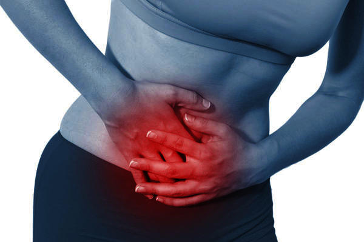

## Definition of CPP

1. Noncyclic
2. Duration of at least 6 months
3. Located in pelvic area
4. Unrelated to pregnancy

---

## Epidemiology

- <b>Chronic pelvic pain in women of reproductive and post-reproductive age: a population-based study.</b>
- CPP is more common in women than in men
- 99 % of all diagnostic laparoscopies for CPP done in the US are performed on women
- 6 to 25 percent prevelance in reproductive age women
- "of 2088 participants, 309 (14.8%) reported CPP"
- "CPP was significantly associated with being of reproductive age (odds ratios (OR) 2.43, 95% CI 1.69-3.48)"

---
 
## Clinical Manifestations

- Multisystem differential: 
- GI
- Urologic
- Gynecologic
- Neuropathic
- Musculoskeletal

---

## GI

- Irritable bowel syndrome
- Inflammatory bowel disease
- Diverticular colitis
- Celiac disease
- Chronic constipation
- Cancer

Deep infiltrating intestinal disorders and endometriosis can present similarly.

---

## Urologic

- Interstitial cystitis
- Renal stones
- Bladder foreign bodies
- Urethral diverticulum

Presenting symptoms can include pain with voiding, urinary urgency and/or frequency (painful bladder syndrome, stone, foreign body, or neoplasia), urethral mass and urinary incontinence (urethral diverticulum), and hematuria (chronic recurrent infection or neoplasia).

---

## Gynecologic 

- Endometriosis
- Adenomyosis
- Prior pelvic inflammatory disease
- Adhesions
- Leiomyoma
- Malignancy

---

## Musculoskeletal

- Myofascial pelvic pain syndrome: tenderness in the pelvic muscles.
- Fibromyalgia: widespread soft tissue tenderness and psychiatric complaints.

---

## Diagnostic Strategy

- Pain associated with hormonal changes may likely result from endometriosis or adenomyosis, while a nonhormonal pattern of pain may signal musculoskeletal causes, adhesions, IBS, or interstitial cystitis. 

-Red flag symptoms, such as unexplained weight loss, hematochezia, perimenopausal irregular bleeding, postmenopausal vaginal bleeding, or postcoital bleeding, should prompt an investigation to rule out malignancy or serious systemic disease.

--- &radio

## Question 1

A 56 year old G2P2 presents complaining of chronic left sided pelvic pain. Abdominal exam reveals a left sided adnexal mass. What is the best next step?

1. _TVUS_
2. CT
3. MRI
4. Laparoscopy
5. Hysteroscopy

*** .hint
Do imaging. 

*** .explanation
Transvaginal ultrasound should be done to evaluate a pelvic mass. If the ultrasound is abnormal, proceed with an MRI or CT.

--- &radio

## Question 2

A 31 year old G0P0 presents complaining of chronic pelvic pain that increases in intensity for 5 days during mensturation. The pain interferes with her daily life and improves with use of a heating pad. She also complains of pain with sex and heavy menstraul bleeding. What is the best next step?

1. _Laparoscopy_
2. _OCPs_
3. Danazol
4. TVUS
5. CT

*** .hint
Diagnosis is endometriosis.

*** .explanation
The presumtive diagnosis of endometriosis can be made. Therapy with estrogen-progestin contraceptives can be tried before pursuing a surgical diagnosis, but inwomen don't want to delay diagnosis laproscopy is definitive. 

--- &radio

## Question 3

A 40-year-old G5 P5 woman complains of heavy vaginal bleeding with clots of 2-year duration and pelvic pain. She takes ibuprofen without relief of her vaginal bleeding. The abdomen reveals a lower abdominal midline irregular mass. On pelvic examination, the cervix is anteriorly displaced. An irregular midline mass approximately 18 weeks’ size seems to move in conjunction with the cervix. No adnexal masses are pal- pated. Her pregnancy test is negative. Her hemoglobin level is 9.0 g/dL, leukocyte count is 6,000/mm3, and platelet count is 160,000/mm3. What is the best next step?

1. OCPs
2. CT
3. _Offer a hysterectomy_
4. TVUS
5. CEA + CA-19

*** .hint
Diagnosis is uterine leiomyomata.

*** .explanation
The patient has anemia despite medical therapy, which constitutes the indication for intervention, such as hysterectomy. If the uterus were smaller, consideration may be given toward another medical agent, such as medroxyprogesterone acetate (Provera).

--- &radio

## Question 4
A 47 year old G3P3 complains of 2/10 chronic pelvic pain for the past 8 years. History reveals that she also suffers from anxiety, fatigue, and "tingling in the arms". She had a TVUS done 3 years ago which was normal. Speculum/vaginal exam is normal. Physical exam reveals multiple widespread tender points at soft tissue locations. UA and bHCG are normal. What is the best next step?

1. EMG
2. repeat TVUS
3. _Cognitive behavioral therapy_
4. CT
5. OCPs

*** .hint
Diagnosis is fibromyalgia.

*** .explanation
Fibromyalgia can cause CPP along with psychiatric complaints (anxiety, depression, ...). 

---

## Conclusion

- Very broad differential
- Must consider multiple systems in workup
- Most common causes are not OBGYN related
- History and physical are critical for narrowing the diagnosis. History should help narrow down to a specific system, and ROS/physical exam can guide you towards a specific diagnosis. 
- Treatment depends on the underlying cause
---

## References

1. https://www.uptodate.com/contents/evaluation-of-chronic-pelvic-pain-in-women?source=search_result&search=chronic%20pelvic%20pain&selectedTitle=1~108

2. Pocket Obstetrics and Gynecology

3. Lange, Case Files OBGYN

4. http://www.aafp.org/afp/2008/0601/p1535.html

